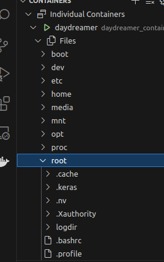

# DayDreamer: World Models for Physical Robot Learning

Official implementation of the [DayDreamer][paper] algorithm in TensorFlow 2.


If you find this code useful, please reference in your paper:

```
@article{wu2022daydreamer,
  title={DayDreamer: World Models for Physical Robot Learning},
  author={Wu, Philipp and Escontrela, Alejandro and Hafner, Danijar and Goldberg, Ken and Abbeel, Pieter},
  journal={Conference on Robot Learning},
  year={2022}
}
```

[paper]: https://danijar.com/daydreamer/

## Method

DayDreamer learns a world model and an actor critic behavior to train robots
from small amounts of experience in the real world, without using simulators.
At a high level, DayDreamer consists of two processes. The actor process
interacts with the environment and stores experiences into the replay buffer.
The learner samples data from the replay buffer to train the world model, and
then uses imagined predictions of the world model to train the behavior.


To learn from proprioceptive and visual inputs alike, the world model fuses the
sensory inputs of the same time step together into a compact discrete
representation. A recurrent neural network predicts the sequence of these
representations given actions. From the resulting recurrent states and
representations, DayDreamer reconstructs its inputs and predicts rewards and
episode ends.

Given the world model, the actor critic learns farsighted behaviors using
on-policy reinforcement learning purely inside the representation space of the
world model.

For more information:

- [Project website](https://danijar.com/project/daydreamer/)
- [Research paper](https://arxiv.org/pdf/2206.14176.pdf)
- [YouTube video](https://www.youtube.com/watch?v=xAXvfVTgqr0)

## Setup

```
pip install tensorflow tensorflow_probability ruamel.yaml cloudpickle
```

## Instructions

To run DayDreamer, open two terminals to execute the commands for the learner
bnd the actor in parallel. To view metrics, point TensorBoard at the log
directory. For more information, also see the [DreamerV2][dv3] repository.

[dv3]: https://github.com/danijar/dreamerv2

## Если вы хотите использовать докер то:
1.Устанавливаем nvidia-container-toolkit
Переходим по этой ссылке и выполняем установку [nvidia-container-toolkit][dv4]

[dv4]: https://docs.nvidia.com/datacenter/cloud-native/container-toolkit/latest/install-guide.html

2.Клонируем репозиторий
```
git clone git@git.sberrobots.ru:legged-robotics-team/real_robot_learning/daydreamer.git
cd daydreamer
git checkout docker
```
3.Заходим в папку daydreamer/rl_docker
```
cd /home/*your_name_user*/*your_pwd*/daydreamer/rl_docker
```
4.Для того чтобы собрать образ контейнера в папке rl_docker вводим:

```bash
bash build.sh
```
5.После сборки контейнера в папке rl_docker прописываем:

```bash
chmod +x setup.sh
```
6.После, чтобы запустить контейнер, пишем в той же директории: 
```
bash run.sh -g <gpus, should be num 1~9 or all> -d <true/false>
# example: bash run.sh -g all -d true
```
Чтобы открыть еще один терминал в этом же контейнере преоделываем пунткты 2 в новом терминале и доходим до папки rl_docker и пропиываем :
```
bash exec.sh -g all -d true
```

После запуска контейнера вы окажетесь в директории home/root/rl_ws в ней же и будет находиться дример и туда вы вводите дальнейшие команды для работы с daydreamer

По умолчанию папка logdir будет находиться в root



### Runtime Issue

If you encounter the following error when running the `run.sh` script:

```
docker: Error response from daemon: could not select device driver "" with capabilities:[[gpu]].
```

You need to install the `nvidia-container-runtime` and `nvidia-container-toolkit` packages, and modify the Docker daemon startup parameter to change the default runtime to `nvidia-container-runtime`:

```bash
vi /etc/docker/daemon.json
```

Update the content to:

```json
{
    "default-runtime": "nvidia",
    "runtimes": {
        "nvidia": {
            "path": "/usr/bin/nvidia-container-runtime",
            "runtimeArgs": []
        }
    }
}
```

## Если вы хотите использовать conda то:
1.Устанавливаем драйвера на видеокарту если их нет и устанавливаем cuda (версия cuda выбирается исходя из версии вашего драйвера)

Переходим по этой ссылке и выполняем установку [drivers and cuda][dv4]

[dv4]: https://www.cherryservers.com/blog/install-cuda-ubuntu

2.Устанавливаем nvidia-container-toolkit
Переходим по этой ссылке и выполняем установку [nvidia-container-toolkit][dv5]

[dv5]: https://docs.nvidia.com/datacenter/cloud-native/container-toolkit/latest/install-guide.html

3.Создаем среду conda 
```
conda create -n daydreamer python=3.10
```
4.Активируем пространство daydreamer
```
conda activate daydreamer
```
5.Скачиваем репозиторий 
```
git clone git@git.sberrobots.ru:legged-robotics-team/real_robot_learning/daydreamer.git 
```
6.Устанавливаем пакеты
```
sudo apt-get update
sudo apt-get install -y software-properties-common build-essential cmake git curl wget
```
7.Устанавливаем библиотеки из файла requirement.txt
```
Установку выполняем в папке daydreamer
pip3 install -r requirement.txt
```

A1 Robot:

```
rm -rf ~/logdir/run1
```

```
CUDA_VISIBLE_DEVICES=0 python embodied/agents/dreamerv2plus/train.py --configs a1 --task a1_sim --run learning --tf.platform gpu --logdir ~/logdir/run1
```

```
CUDA_VISIBLE_DEVICES=1 python embodied/agents/dreamerv2plus/train.py --configs a1 --task a1_real --run acting --tf.platform gpu --env.kbreset True --imag_horizon 1 --replay_chunk 8 --replay_fixed.minlen 32 --imag_horizon 1 --logdir ~/logdir/run1
```

Go1 Robot:

```
В окне pygame нажимать клавишу :
  -p (английская раскладка) - поставить процесс обучения на паузу
  -с (английская раскладка) - продолжить обучение после пазы
```

For Sim

```
Чтобы изменить папку в которую мы хотим сохранять данные обучения ,то измените это : ~/logdir/run1 
```

```
В случае если вы хотите удалить файлы с предыдущего обучения 

rm -rf ~/logdir/run1

Но если вы хотите продолжить начатое вами обучение то это делать не надо ,так как оно удалит все ранее созданные вами файлы обучения
```

```
CUDA_VISIBLE_DEVICES=0 python embodied/agents/dreamerv2plus/train.py --configs go1 --task go1_sim --run learning --tf.platform gpu --logdir ~/logdir/run1
```

```
Если вы хотите производить обучение только на одной видеокарте ,то значение CUDA_VISIBLE_DEVICES должно быть одинаковым
```

```
CUDA_VISIBLE_DEVICES=0 python embodied/agents/dreamerv2plus/train.py --configs go1 --task go1_sim --run acting --tf.platform gpu --env.kbreset True --imag_horizon 1 --replay_chunk 8 --replay_fixed.minlen 32 --imag_horizon 1 --logdir ~/logdir/run1
```

For Real

```
CUDA_VISIBLE_DEVICES=0 python embodied/agents/dreamerv2plus/train.py --configs go1 --task go1_real --run learning --tf.platform gpu --logdir ~/logdir/run1
```

```
CUDA_VISIBLE_DEVICES=0 python embodied/agents/dreamerv2plus/train.py --configs go1 --task go1_real --run acting --tf.platform gpu --env.kbreset True --imag_horizon 1 --replay_chunk 8 --replay_fixed.minlen 32 --imag_horizon 1 --logdir ~/logdir/run1
```

XArm Robot:

```
rm -rf ~/logdir/run1
```

```
CUDA_VISIBLE_DEVICES=0 python embodied/agents/dreamerv2plus/train.py --configs xarm --run learning --task xarm_dummy --tf.platform gpu --logdir ~/logdir/run1
```

```
CUDA_VISIBLE_DEVICES=-1 python embodied/agents/dreamerv2plus/train.py --configs xarm --run acting --task xarm_real --env.kbreset True --tf.platform cpu --tf.jit False --logdir ~/logdir/run1
```

UR5 Robot:

```
rm -rf ~/logdir/run1
```

```
CUDA_VISIBLE_DEVICES=0 python embodied/agents/dreamerv2plus/train.py --configs ur5 --run learning --task ur5_dummy --tf.platform gpu --logdir ~/logdir/run11
```

```
CUDA_VISIBLE_DEVICES=1 python embodied/agents/dreamerv2plus/train.py --configs ur5 --run acting --task ur5_real --env.kbreset True --tf.platform cpu --tf.jit False --logdir ~/logdir/run11
```

## Questions

Please [open an issue][issues] on Github.

[issues]: https://github.com/danijar/daydreamer/issues
